# Work with GitHub Notebooks in Oracle Machine Learning UI

## Introduction

This lab walks you through the steps to access the GitHub interface pages in OML UI, create a GitHub credential, clone and import a GitHub notebook, and edit and sync your GitHub notebook. 

Estimated Time: 20 minutes

### About GitHub Notebooks

Oracle Machine Learning Notebooks is integrated with GitHub repositories thereby enabling you to import OML, Jupyter, and Zeppelin notebooks from GitHub into OML Notebooks. After working on your notebooks, you can synchronize the changes back to GitHub repo by the click of the **Push & Commit** button. The GitHub and OML Notebooks integration also supports the capabilities for versioning and sharing notebooks within the OML environment.

### Objectives

In this lab, you will learn how to:
* Create GitHub Credentials
* Generate a Personal Access Token
* Clone and import a GitHub Notebook
* Edit and sync your GitHub Notebooks


### Prerequisites

This lab assumes you have:
* An Oracle Machine Learning account
* Access to Oracle Machine Learning USER account
* A GitHub repository with notebooks

## Task 1: Create a GitHub Credential

You must have separate credentials to connect to your GitHub repositories that are marked private. The credential object with your GitHub credentials are stored in the Autonomous AI Database. The credentials contain the necessary information such as name, email, personal access token and so on.

> **Note:** GitHub repositories that are `public` can be accessed without credentials. 

The GitHub Credential interface in Oracle Machine Learning UI is the interface where you create the database credential objects to connect to your GitHub repositories.

To create a GitHub credential:

1. On the Oracle Machine Learning UI home page, click **GitHub Credentials**. Alternatively, you may click on the user profile drop-down menu, click **GitHub** and then click **Credentials**. This opens the **GitHub Credentials** page.

	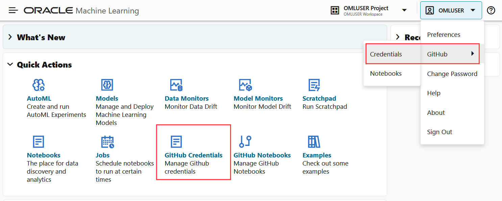

2. On the GitHub Credentials page, click **Create**. The Create Credentials dialog opens.

	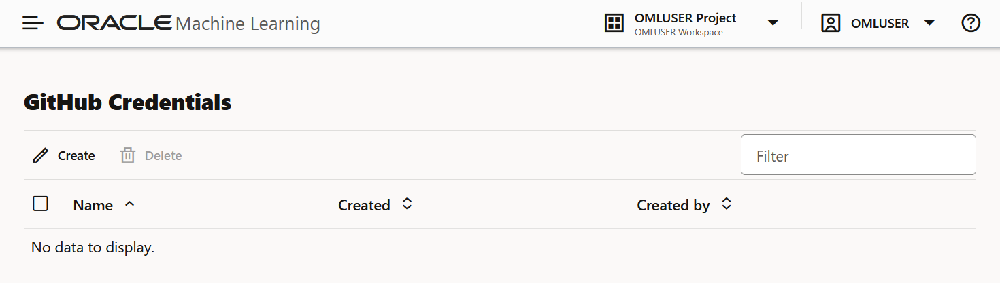

3. On the Create Credentials dialog, provide the following details: 

	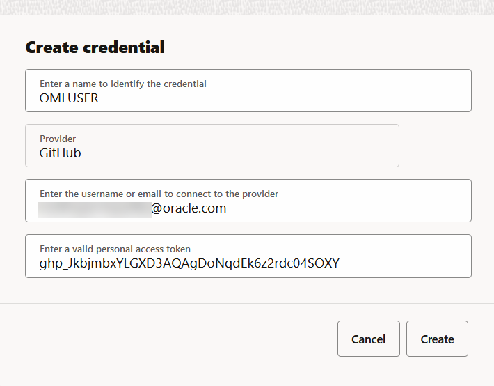

	* **Name:** This is a name to identify this credential. 
	* **Provider:** This is the name of the external repository. Currently, only the GitHub repository is supported.
	* **Email:** This is the email ID of the Git user that created the repository. The maximum limit is 128 characters.
	* **Token:** This is the Personal Access Token, a secure method to authenticate with GitHub repository. You can generate it from your GitHub profile. 
	
	> **Note:** See _Task 2: Generate Personal Access Token_ for details.
	
	* Click **Create**.
	
	This completes the task of creating the credentials and takes you back to the GitHub Credentials page. The user credential that you just created is now listed on this page. 

	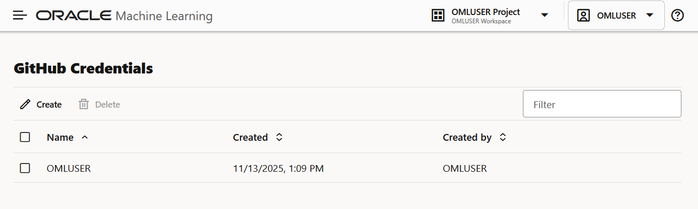

## Task 2: Generate Personal Access Token

A Personal Access Token (PAT) is an authentication token. It is a secure method used for user authentication. 

To generate the Personal access token:

1. Open your GitHub profile, scroll down and click **Settings**. This opens the GitHub Settings page.

	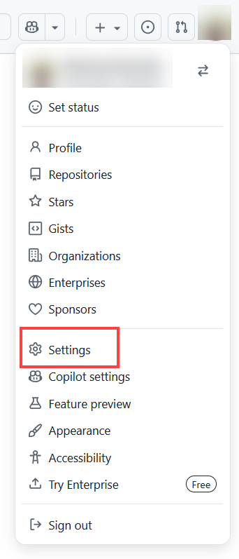

2. On the left navigation of your GitHub Settings page, scroll down and click **Developer Settings**. 

	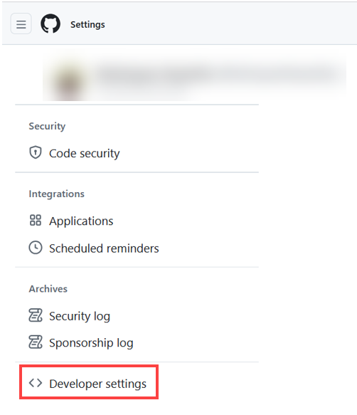

3. On the left navigation of the Developer Settings page, expand **Personal access tokens** and click **Tokens (classic)**.

	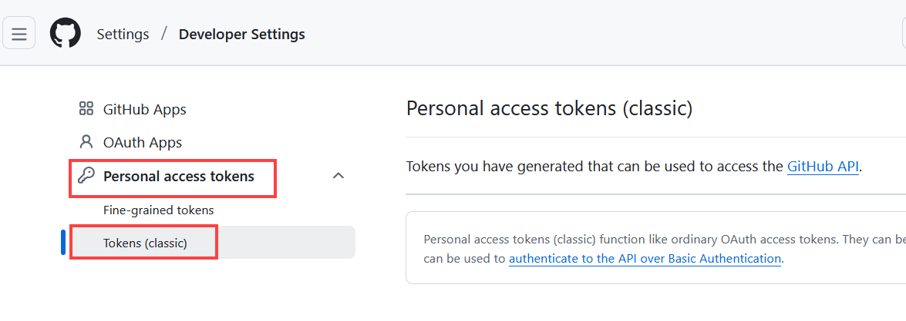

4. On the right pane, click **Generate new tokens** and then click **Generate new token (classic).**

	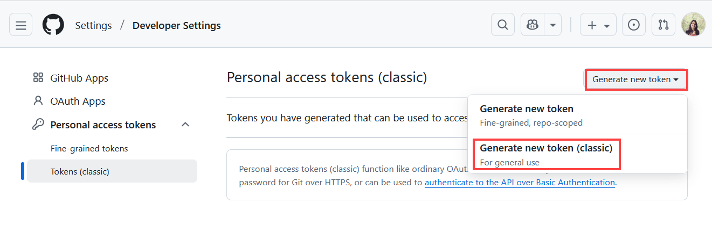

5. On the New personal access token (classic) page, enter the following:

	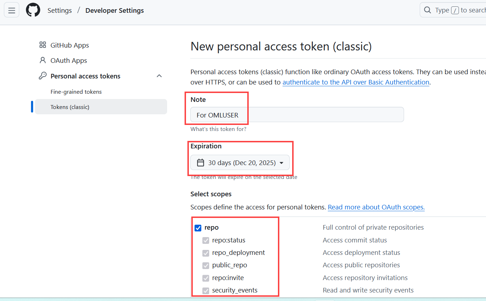

	* **Note:** Enter any note about the token.
	* **Expiration Date:** Click the down arrow and select an option about the validity of this token.
	* **Scope:** In this entire section, select repo.

6. Scroll down the page and click **Generate token**. The token is generated. 

	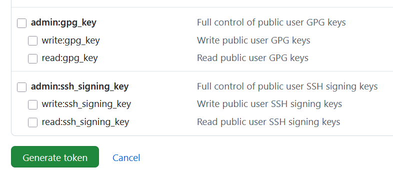

7. Click the copy icon to copy the token and use it when creating the GitHub credentials in Oracle Machine Learning UI. 

	


## Task 3: Clone and Import a GitHub Notebook

This task demonstrates how to create notebooks based on Example templates. You will learn how to:

1. Go to your Oracle Machine Learning Notebooks listing page and click **Import.** Here, you have two options—File and Git. Click **Git.** This opens the Git Clone dialog. 

	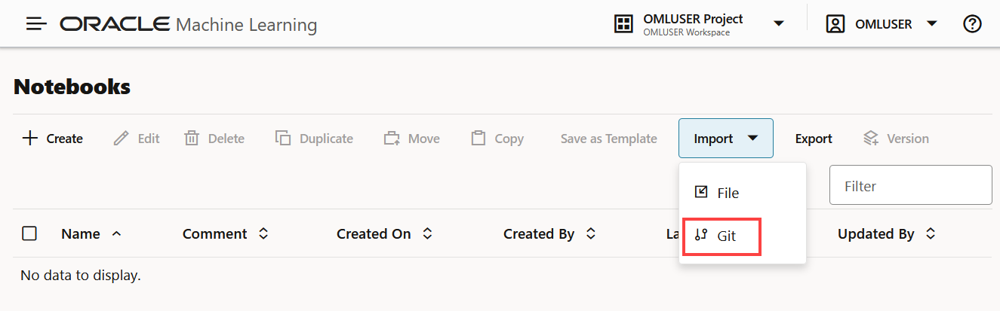

2. On the Git Clone dialog, enter these details:

	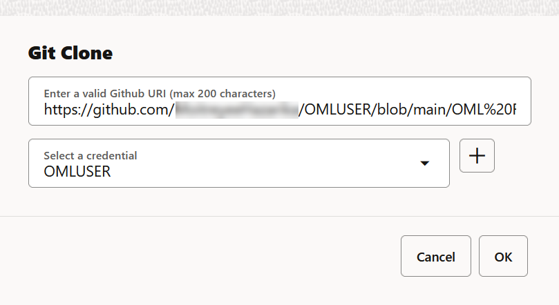

	* **Enter a valid GitHub URI:** Paste the URL of the GitHub notebook you want to import. To obtain the URI of the notebook, go to your GitHub repository, right-click on the notebook you want to import and click **Copy Link.** Paste this link on the **GitHub URI** field in the Git Clone dialog. 
		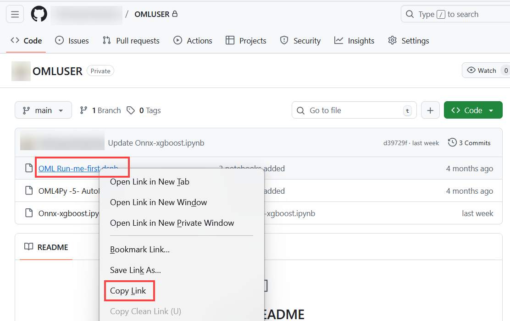
	* **Select a credential:** Click the down arrow to select a credential. If you do not have a credential created, click the + icon to create one. 
	See _Task 1: Create a GitHub Credential_ for more information.
3. Click **OK**. This starts cloning your GitHub notebook. Once completed, it opens the notebook in the Notebook editor.

This completes the task of cloning and importing a notebook from your GitHub repository. 


## Task 4: Edit and Sync your GitHub notebook

You can update remote changes in your notebooks and also upload local changes in the notebooks back to your GitHub repository using the Version Control options — **Pull changes** and **Push & commit** in OML notebook editor to synchronize the cloned notebook with your GitHub repository copy of the notebook. 

You can sync your GitHub notebooks by using these options:
* **Commit and Push:** Use this option to save and commit the edits done to the cloned (local) copy of your GitHub notebook to your GitHub repository. 
* **Pull changes:** Use this option to pull or update all changes from your Github repository to your cloned (local) copy of your GitHub notebook.
* **Change branch and pull changes:** Use the checkout option  to change the repository branch and pull all changes in the cloned copy of your GitHub notebook from the updated branch. 

To edit and sync the changes in your GitHub notebook:

1. Access and open your GitHub notebook. You can access all your cloned GitHub notebooks from:

	* The **GitHub Notebooks listing page:** To access your GitHub Notebooks listing page, click **GitHub Notebooks** on the Oracle Machine Learning UI home page. Alternatively, you may click on the user profile drop-down menu on the top-right corner of the Oracle Machine Learning UI home page. Click **GitHub**, and then click **Notebooks.**  

		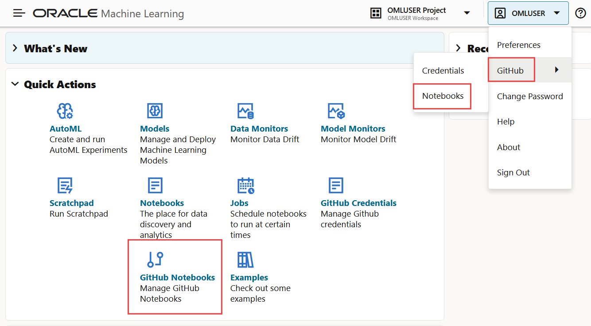
		This opens the GitHub Notebooks listing page as shown here. The Run-me-first notebook you just cloned is now listed here. To open it, click on the notebook name. 
		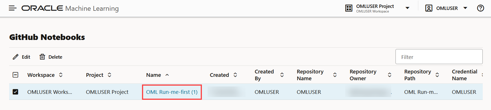

	* The **Oracle Machine Learning Notebooks listing page:** To access your OML Notebooks listing page, click **Notebooks** on the OML UI home page. Alternatively, you may go to the Oracle Machine Learning UI left navigation pane, expand **Projects** and then click **Notebooks.** 
		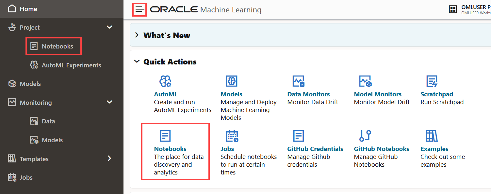
		This opens the OML Notebooks listing page as shown here. The _Run-me-first_ notebook you just cloned is now listed here. To open it, click on the notebook name.
		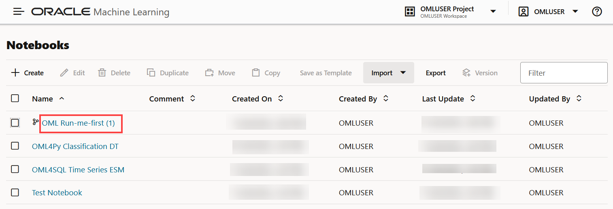

		> **Note:** The 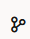 icon against the notebook indicates that it is cloned GitHub notebook. 	

2. Once the notebook is opened in the Notebook editor, run the following script in a %python paragraph:

	```
	<copy>
	%python

	data = [
		["Asia", "India", 800],
		["Asia", "China", 900],
		["Asia", "Japan", 425],
		["Europe", "Germany", 383],
		["Europe", "France", 467],
		["Europe", "Italy", 360],
		["Africa", "Nigeria", 416],
		["Africa", "Egypt", 510],
		["Americas", "USA", 631],
		["Americas", "Brazil", 413]
	]

	print("Continent\tCountry\tPopulation")
	for row in data:
		print(f"{row[0]}\t{row[1]}\t{row[2]}")

	</copy>
	```

3. After running the paragraph in your notebook, click  on the top of the notebook editor. This opens the **Version Control** pane on the right. Click **Commit & Push.** The Commit and Push dialog opens. 

	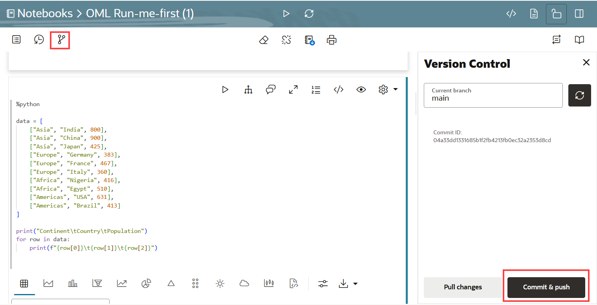

4. In the Commit and Push dialog, evaluate your changes. You may add a note on the **Commit message** field. Click **Continue.**  This starts committing the changes to the repository. 
	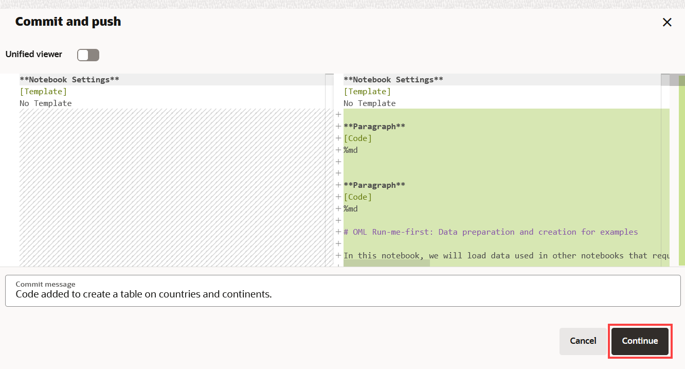

5. Once the changes are committed successfully, a confirmation message is displayed:  
	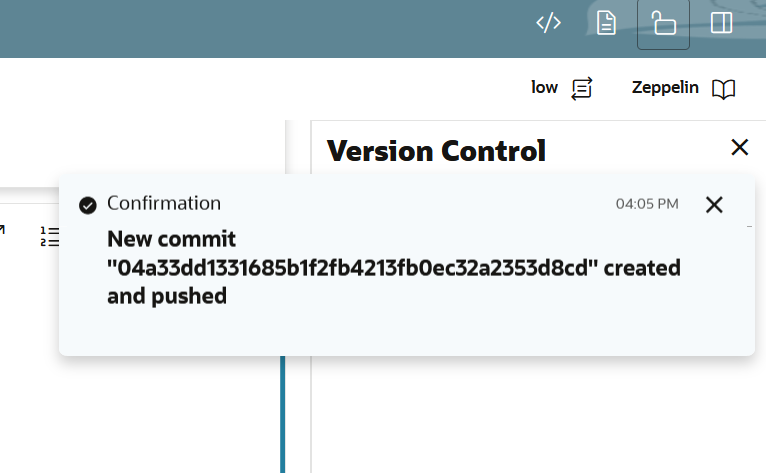
	The Version Control pane on the right now displays the newly committed ID.  
	

4. The other options to sync your GitHub notebook are: 

	* **Pull Changes**
	* **Change branch and pull changes:**

5. **Pull Changes:**  To pull or update all changes from your GitHub repository to your cloned copy in Oracle Machine Learning UI, click **Pull changes.**
	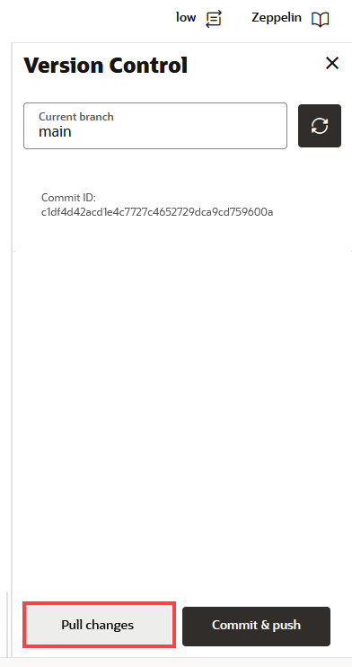
	A confirmation dialog opens with the repository branch name. Note the GitHub repository branch name in the **Current branch** field. Click **Pull** to confirm. 
	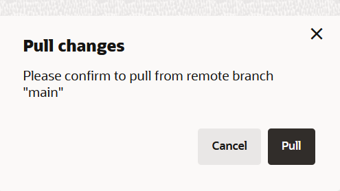

	Once complete, it displays the confirmation message as shown here: 

	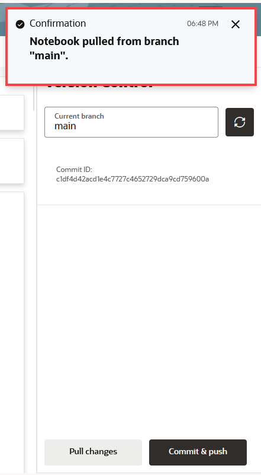

6. **Change branch and pull changes:** To change the branch from the default `main`, paste the name of the branch in the **Current branch** field. In this example, there is already a branch by the name `oml-notebook`. This is pasted in the **Current branch** field here. Click . This changes the branch and pulls all changes in the notebook from the updated branch to your cloned copy in Oracle Machine Learning UI. Once complete, it displays the confirmation message: Current branch is set to <branch name>.
	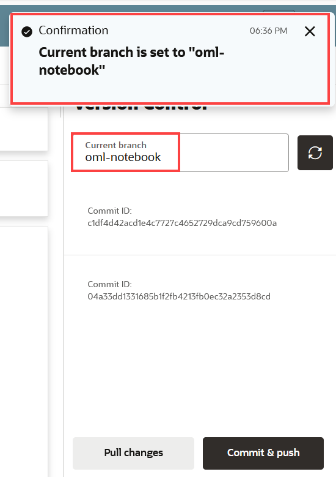

This completes the task of accessing the GitHub interface pages in Oracle Machine Learning UI, creating a GitHub credential, cloning and importing a GitHub notebook, and editing and syncing your GitHub notebook.  You may now **proceed to the next lab**.

## Learn More

* [Oracle Machine Learning UI](https://docs.oracle.com/en/database/oracle/machine-learning/oml-notebooks/)
* [Interactive Tour - Oracle Machine Learning UI](https://docs.oracle.com/en/cloud/paas/autonomous-database/oml-tour/)

## Acknowledgements

* **Author** : Moitreyee Hazarika, Consulting User Assistance Developer, Oracle AI Database User Assistance Development
* **Contributors**: Mark Hornick, Senior Director, Data Science and Machine Learning; Marcos Arancibia Coddou, Product Manager, Oracle Data Science; Sherry LaMonica, Consulting Member of Tech Staff, Machine Learning
* **Last Updated By/Date**: Moitreyee Hazarika, November 2025
