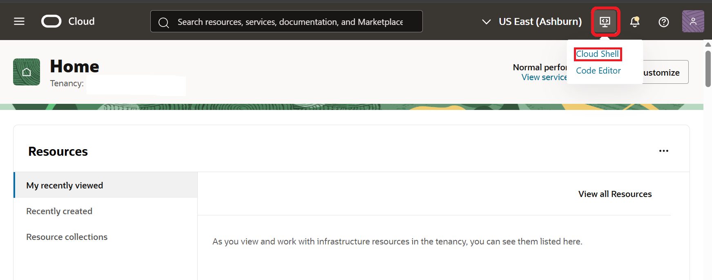
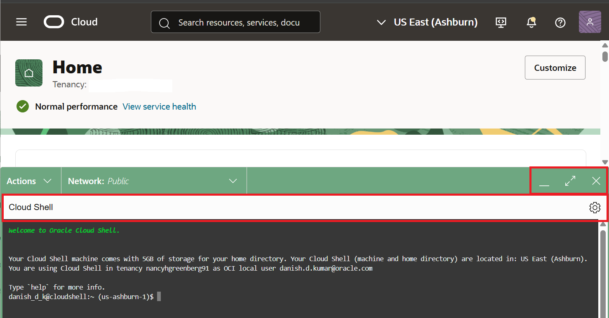

# Run user-defined functions using the REST API for Embedded Python Execution

## Introduction

This lab walks you through the steps to use the REST API to call OML4Py Embedded Python Execution functions to run custom Python code.

Estimated Time: 20 minutes

### About Embedded Python Execution
Embedded Python execution enables you to run user-defined Python functions in Python engines spawned by the Autonomous AI Database environment. The REST API for embedded Python execution with Autonomous AI Database provides REST endpoints for setting authorization tokens, executing Python scripts, and synchronously and asynchronously running jobs.

To run a script from the REST API, it must reside in the Python script repository. An Oracle Machine Learning username and password must be provided for authentication.

* `do-eval`&mdash;Runs the provided user-defined Python function in a Python engine spawned by the Autonomous AI Database environment.
* `table-apply`&mdash;Runs the provided user-defined Python function data referenced by an OML DataFrame proxy object in a single Python engine.
* `group-apply`&mdash;Partitions a database table by the values in one or more columns and runs the provided user-defined Python function on each partition, optionally in parallel using multiple Python engines.
* `row-apply`&mdash;Partitions a database table into sets of rows and runs the provided user-defined Python function on the data in each set, optionally in parallel using multiple Python engines.
* `index-apply`&mdash;Runs a Python function multiple times, passing in a unique index of the invocation to the user-defined function, optionally in parallel using multiple Python engines.

To view the full list of endpoints available, refer to the Oracle Machine Learning for Python REST API for Embedded Python Execution

> **Note:** Embedded Python Execution functions are also available through the [Oracle Machine Learning for Python SQL API for Embedded Python Execution](https://docs.oracle.com/en/database/oracle/machine-learning/oml4py/1/mlpug/sql-api-embedded-python-execution-oracle-autonomous-database.html#GUID-BFC5E8C9-6ACC-4993-B0E8-41138B2E479E).

### Objectives

In this lab, we provide a workflow for using the OML4Py REST API for embedded Python execution with Oracle Autonomous AI Database:

* Obtain an authorization token to access the REST API for embedded Python execution
* Create a user defined function (UDF) and store it in the OML4Py script repository
* Run the UDF using embedded Python execution from the OML4Py Python and REST APIs


### Prerequisites

  We need to view the markdown in the OML notebook for this lab, and access the OCI Cloud Shell to run the associated cURL commands.

**Access and run the OML notebook for this lab.**

  > **NOTE:** If you have problems with downloading and extracting the ZIP file in Lab 1 Task 2, please 
  <if type="freetier">[**CLICK HERE** to download the "Lab 7 - Run UDFs with REST API for EPE" notebook DSNB file](<./../notebooks/Lab 7 - Run UDFs with REST API for EPE.dsnb?download=1>)</if><if type="livelabs">[**CLICK HERE** to download the "Lab 7 - Run UDFs with REST API for EPE" notebook DSNB file](<./../notebooks/Lab 7 - Run UDFs with REST API for EPE.dsnb?download=1>)</if><if type="freetier-ocw23">[**CLICK HERE** to download the "Lab Bonus 3 - Run UDFs with REST API for EPE" notebook DSNB file](<./../notebooks/Lab Bonus 3 - Run UDFs with REST API for EPE.dsnb?download=1>)</if><if type="livelabs-ocw23">[**CLICK HERE** to download the "Lab Bonus 3 - Run UDFs with REST API for EPE" notebook DSNB file](<./../notebooks/Lab Bonus 3 - Run UDFs with REST API for EPE.dsnb?download=1>)</if>. This notebook contains the scripts for this Lab. Save it to your local machine and import it like illustrated in **Lab 1, Task 2, Step 1**.

  Go back to the main Notebooks page by clicking on the Cloud menu icon  on the upper left of the screen to open the left navigation pane, and then click **Notebooks**. 

  

  <if type="freetier">
  Click the **Lab 7** notebook to view it.

   </if>

  <if type="livelabs">
  Click the **Lab 7** notebook to view it.

   </if>

  <if type="freetier-ocw23">
  Click the **Lab Bonus 3** notebook to view it.

   </if>

  <if type="livelabs-ocw23">
  Click the **Lab Bonus 3** notebook to view it.

   </if>

  OML Notebooks will create a session and make the notebook available for editing.

  You can optionally click the **Run all paragraphs** () icon, and then click **Confirm** to refresh the content with your data, or just scroll down and read the pre-recorded results.  

  <if type="freetier">
  
  </if>
  <if type="livelabs">
  
  </if>
  <if type="freetier-ocw23">
  
  </if>
  <if type="livelabs-ocw23">
  
  </if>


**Access the OCI Cloud Shell to run cURL commands**

To access the OCI Cloud Shell to run the associated cURL commands:

1. Click the Developer Tools icon on your OCI console and then click Cloud Shell.  

  

2. The Oracle Cloud Shell interface opens at the bottom of your OCI console page. Here, you can run your cURL commands.  At the right in the green bar that opens up you also have options to maximize, minimize or close the Cloud Shell window.

  

## Task 1: Obtain an Access Token

1. Follow the flow of the notebook by scrolling to view and run each paragraph of this lab.

  Scroll down to the beginning of Task 1.

  

  

  You will use the following code in OCI Cloud Shell, replacing `yourusername`, `yourpassword` and `OML Service URL` with the ones for your service.

    ``` 
    <copy>
      curl -X POST --header 'Content-Type:application/json' \
      --header 'Accept:application/json' \
      -d '{"grant_type":"password", "username":"'yourusername'","password":"'yourpassword'"}' 
      "OML service URL/omlusers/api/oauth2/v1/token"
    ```

1. First, let's export the appropriate environmental variables.  Follow the flow of the notebook by scrolling to view the code, and copy and run each paragraph of the lab as appropriate in the OCI Cloud Shell, replacing the required information with yours.

  Scroll down to the beginning of Task 1.1.
  

3. Follow the flow of the notebook by scrolling to view and run each paragraph of this lab.

  Scroll down to the beginning of Task 1.2.
  

## Task 2:  Obtain a proxy object to the IRIS table
1. Follow the flow of the notebook by scrolling to view and run each paragraph of this lab.

  Scroll down to the beginning of Task 2.

  

## Task 3: Build a Scikit-Learn Python model using embedded Python execution
1. Follow the flow of the notebook by scrolling to view and run each paragraph of this lab.

  Scroll down to the beginning of Task 3.

  

2. Follow the flow of the notebook by scrolling to view and run each paragraph of this lab.

  Scroll down to the beginning of Task 3.1.

  

## Task 4: Use the table-apply function to invoke the script from the Python API for EPE
1. Follow the flow of the notebook by scrolling to view and run each paragraph of this lab.

  Scroll down to the beginning of Task 4.

  

2. Follow the flow of the notebook by scrolling to view and run each paragraph of this lab.

 Scroll down to the beginning of Task 4.1.

  

3. Follow the flow of the notebook by scrolling to view and run each paragraph of this lab.

 Scroll down to the beginning of Task 4.2

  

4. Follow the flow of the notebook by scrolling to view and run each paragraph of this lab.

 Scroll down to the beginning of Task 4.3.

  

## Task 5: Run the same function using the REST API table function table-apply
1. Follow the flow of the notebook by scrolling to view and run each paragraph of this lab.

   Scroll down to the beginning of Task 5.

  

    >> Note: To run cURL commands, see **Access the OCI Cloud Shell to run cURL commands** in the **Prerequisites** section.

2. Follow the flow of the notebook by scrolling to view and run each paragraph of this lab.

  Scroll down to the beginning of Task 5.1.

  

## Task 6: Create a UDF to score using system-supported data-parallelism

1. Follow the flow of the notebook by scrolling to view and run each paragraph of this lab.

   Scroll down to the beginning of Task 6.
   

2. Follow the flow of the notebook by scrolling to view and run each paragraph of this lab.

   Scroll down to the beginning of Task 6.1.
   


3. Follow the flow of the notebook by scrolling to view and run each paragraph of this lab.

   Scroll down to the beginning of Task 6.2.
   

   >> Note: To run cURL commands, see **Access the OCI Cloud Shell to run cURL commands** in the **Prerequisites** section.

## Task 7: Work with Asynchronous Jobs

1. Follow the flow of the notebook by scrolling to view and run each paragraph of this lab.

   Scroll down to the beginning of Task 7.
   

2. Follow the flow of the notebook by scrolling to view and run each paragraph of this lab.

   Scroll down to the beginning of Task 7.1.
   

  >> Note: To run cURL commands, see **Access the OCI Cloud Shell to run cURL commands** in the Prerequisites section.

3. Follow the flow of the notebook by scrolling to view and run each paragraph of this lab.

   Scroll down to the beginning of Task 7.2.
   

4. Follow the flow of the notebook by scrolling to view and run each paragraph of this lab.

   Scroll down to the beginning of Task 7.3.
   

### Congratulations !!!

You reached the end of the this lab.  

You can explore additional workshops related to Oracle Machine Learning from the link in the **Learn More** section.  

## Learn more

* [Embedded Python Execution](https://docs.oracle.com/en/database/oracle/machine-learning/oml4py/2/mlpug/embedded-python-execution.html#GUID-AF448E56-B843-4749-979A-F89D359A8728)
* [Oracle Machine Learning Notebooks](https://docs.oracle.com/en/database/oracle/machine-learning/oml-notebooks/)

## Acknowledgements
* **Authors** - Marcos Arancibia, Product Manager, Machine Learning; Jie Liu, Data Scientist; Moitreyee Hazarika, Principal User Assistance Developer; Dhanish Kumar, Senior Member of Technical Staff
* **Contributors** -  Mark Hornick, Senior Director, Data Science and Machine Learning; Sherry LaMonica, Principal Member of Tech Staff, Machine Learning
* **Last Updated By/Date** - Dhanish Kumar, July 2025