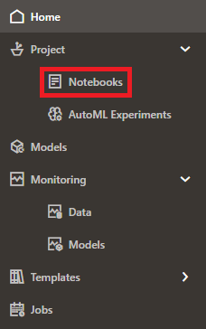

# Use in-database algorithms and models

## Introduction
This lab highlights a few of the machine learning algorithms and features available in OML4Py: Generalized Linear Models (GLM), Expectation-Maximization Clustering, partitioned models, and model explainability.

Estimated Time: 25 minutes

### About in-database algorithms and models
The in-database parallelized machine learning algorithms are exposed through a natural Python interface. A range of machine learning techniques are supported, including classification, regression, clustering, attribute importance, anomaly detection, association rules, and feature extraction. With OML4Py, users can build more models on more data, and score large volume data – faster – taking advantage of Autonomous Database optimizations – including auto-scale. Data Scientists benefit from automatic data preparation, partitioned model ensembles, and integrated text mining. This can result in increased productivity for data scientists, while at the same time, the powerful in-database algorithms are made more accessible to non-expert users.

The in-database, parallelized algorithms keep data under database control – no need to extract data to separate machine learning engines, which can be time-consuming and introduces issues of data security, storage, and currency. In-database algorithms are fast and scalable, enable batch and real-time scoring, and provide explanatory prediction details, so you can understand why an individual prediction is made. This is the core of the "bring the algorithms to the data" tagline.

In-database machine learning models are first-class objects in Oracle Database. You can control access by granting and revoking permissions, audit user actions, and export and import machine learning models across databases. In-database models produced through the Python API can also be accessed using the SQL API.

### Objectives

In this lab, you will learn how to:
* Predict numerical values using Regression (Generalized Linear Model)
* Work with clustering using Expectation-Maximization
* Work with partitioned models
* Use the Model Explainability feature to rank attributes

### Prerequisites

1. We need to access and run the OML notebook for this lab.

    > **NOTE:** If you have problems with downloading and extracting the ZIP file in Lab 1 Task 2, please [**CLICK HERE** to download the "Lab 3 - Use in-database algorithms and models" notebook DSNB file](<./../notebooks/Lab 3 - Use in-database algorithms and models.dsnb?download=1>). This notebook contains the scripts for **Lab 3**. Save it to your local machine and import it like illustrated in **Lab 1, Task 2, Step 1**.

2. Go back to the main Notebooks page by clicking on the Cloud menu icon  on the upper left corner of the page, and then select **Notebooks**. 
   
   
   
3. Click the **Lab 3** notebook to view it.
   
   <if type="freetier">
    </if>
   <if type="livelabs">
    </if>
   <if type="freetier-ocw23">
    </if>
   <if type="livelabs-ocw23">
    </if>

   OML Notebooks will create a session and make the notebook available for editing.

   You can optionally click the **Run all paragraphs** () icon, and then click **Confirm** to refresh the content with your data, or just scroll down and read the pre-recorded results.  

   

## Task 1: Import libraries
1. Follow the flow of the notebook by scrolling to view and run each paragraph of this lab.

  Scroll down to the beginning of Task 1.

    

## Task 2: Work with regression using generalized liner model (GLM)
1. Follow the flow of the notebook by scrolling to view and run each paragraph of this lab.

  Scroll down to the beginning of Task 2.

  

## Task 3: Work with clustering using Expectation-Maximization
1. Follow the flow of the notebook by scrolling to view and run each paragraph of this lab.

  Scroll down to the beginning of Task 3.

  

## Task 4: Work with Partitioned Models
1. Follow the flow of the notebook by scrolling to view and run each paragraph of this lab.

  Scroll down to the beginning of Task 4.

  

## Task 5: Rank attribute importance using model explainability
1. Follow the flow of the notebook by scrolling to view and run each paragraph of this lab.

  Scroll down to the beginning of Task 5.

   

After you reach the end of Lab 3, you can *proceed to the next lab*.

## Learn more

* [About Machine Learning Classes and Algorithms](https://docs.oracle.com/en/database/oracle/machine-learning/oml4py/2/mlpug/classes-that-provide-access-database-ml-algorithms1.html#GUID-00F8AF8F-6652-4161-BEEF-E737A68FB53C)
* [Get Started with Oracle Machine Learning Notebooks](https://docs.oracle.com/en/database/oracle/machine-learning/oml-notebooks/)

## Acknowledgements
* **Authors** - Marcos Arancibia, Product Manager, Machine Learning; Jie Liu, Data Scientist; Moitreyee Hazarika, Principal User Assistance Developer; Dhanish Kumar, Senior Member of Technical Staff
* **Contributors** -  Mark Hornick, Senior Director, Data Science and Machine Learning; Sherry LaMonica, Principal Member of Tech Staff, Machine Learning
* **Last Updated By/Date** -  Marcos Arancibia, August 2023, Moitreyee Hazarika, June 2024, Dhanish Kumar, January 2025
